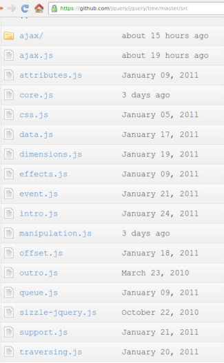

!SLIDE center

# jQuery Modules #

# Modularity #

!SLIDE center

# jQuery Modules #

# Yehuda no me la suda #

!SLIDE center

# All jQuery can #
# be individually loaded #

!SLIDE center

!SLIDE

# jQuery API #

## chain methods ##

    @@@ javascript

    $("div").addClass("redbox")

!SLIDE

# jQuery API #

## chain methods ##

    @@@ javascript

    $("div").addClass("redbox").fadeOut();

!SLIDE

# jQuery API #

## one method many use cases ##

    @@@ javascript
    $(...).html();

    $(...).html("
Hello!
");

    $(...).html(function(i){
        return "
Hello " + i + "
";
    });

!SLIDE bullets

* DOM
* Events
* Effects
* Ajax
* Plugins

!SLIDE smbullets

* jQuery Core
* Selectors
* Attributes
* Traversing
* Manipulation
* CSS
* Events
* Effects
* Ajax
* Utilities

!SLIDE

# jQuery Core #

    @@@ javascript
    jQuery('css selector');
    $('css selector');
    jQuery(function(){
      // executed when DOM ready
    })
    $.sub(); // New in 1.5

## One method many uses cases ##

!SLIDE bullets

# DOM - Selectors #

* Borrowing from CSS1-3
* Using Sizzle

!SLIDE bullets

# DOM - Selectors #

    @@@ javascript
    $.expr.filters.withRel = function(elem){
      return ($(elem).attr('rel') !== undefined);
    };
    $("clase:withRel");

!SLIDE smaller

# DOM - Attributes #

    @@@ javaScript
    $("input").attr("id"); // returns id
    $("input").attr("id", "email"); // sets id to email
    $("input").attr("id", function(){ return this.name });
    $("input").removeAttr("id");

    // HTML5 data attributes
    $("input").data("disable-with")

!SLIDE

# DOM - Attributes/Classes #

    @@@ javaScript
    $(".comment").addClass("read");
    $(".comment").removeClass("read");
    $(".comment").toggleClass("read");

!SLIDE

# DOM - Attributes/Other #

    @@@ javaScript
    // returns the selected option value
    $("select").val();
    $(".comment:first").html()

!SLIDE

# DOM - Traversing #

    @@@ javaScript
    $("div").parents();
    $("div").siblings();
    $("div").next();
    $("div").prev();
    $("div").closest("a");

!SLIDE

# DOM - Manipulation #

    @@@ javaScript
    $("#content").append("
Hi everyone!
");
    $("
Hi everyone!
").appendTo("#content");
    $("#content").prepend("
Hi everyone!
");
    $("
Hi everyone!
").prependTo("#content");

!SLIDE smaller

# DOM - Manipulation #

    @@@ javascript
    $("body")                 [body]
      .find("p")              [p, p] => [body]
        .find("a")            [a, a] => [p, p] => [body]
            .addClass("foo")
        .end()                [p, p] => [body]
      .end()                  [body]

!SLIDE

# DOM - CSS #

    @@@ javascript
    $("p").mouseover(function () {
      $(this).css("color","red");
    });

    $("span").click(function () {
      $(this).css("background-color","yellow");
    });

    $.cssHooks // You want superpowers

!SLIDE

# Events #

    @@@ javascript
    $("li").bind("click", function(){
      alert("You clicked me!")
    });

    // Event binding shortcut
    $("li").click(function(){
      alert("You clicked me!")
    });

    // fire events
    $("li:first").click();
    $("li:first").trigger("click");

!SLIDE

# Effects #

    @@@ javascript
    $("div").fadeIn();
    $("div").fadeOut("slow");
    $("div").slideDown();
    $("div").slideUp("slow");
    $("button").click(function () {
      $("p").slideToggle("slow");
    });

    // queues ;)

[Ben Nadel](http://www.bennadel.com/blog/1864-Experimenting-With-jQuery-s-Queue-And-Dequeue-Methods.htm)
[Yehuda](http://stackoverflow.com/questions/881222/how-do-i-go-about-getting-the-ajax-queue-plugin-working-in-jquery-1-3)

!SLIDE

# Ajax #

## core method ##

    @@@ javascript
    $.ajax({
      url: "test.html",
      success: function(data){
        $("#results").append(data);
      }
    });

!SLIDE

# Ajax - Helper methods #

    @@@ javascript
    $.get()
    $.post();
    $.getJSON();
    $.getScript();
    $(...).load();

!SLIDE

# Utilities #

    @@@ javascript
    $.extend();
    $.map();
    $.merge();
    $.noop();
    $.proxy();
    $.parseJSON();

!SLIDE smaller

# Utilities - extend() #

### common plugin pattern ###

    @@@ javascript
    var empty = {}
    var defaults = { validate: false, limit: 5, name: "foo" };
    var options = { validate: true, name: "bar" };
    var settings = $.extend(empty, defaults, options);

    settings == { validate: true, limit: 5, name: "bar" }
    empty == { validate: true, limit: 5, name: "bar" }
