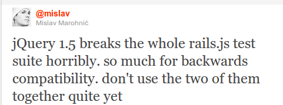
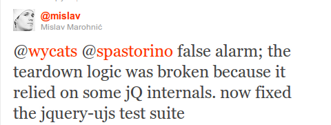

!SLIDE

# jQuery #
# Best Practices #

!SLIDE bullets

# Tip 1: Stay up to date #

* Always use the latest version of jQuery core
* Performance improvements and bug fixes
* jQuery 1.4.3
*   rewrite CSS module
*   HTML5 data attributes
* jQuery 1.5
*   rewrite Ajax module
*   deferred objects

!SLIDE center

# Quick Tip: Test the code while update #

!SLIDE center

# Quick Tip: Test the code while update #

!SLIDE bullets smaller

# Tip 2: Know Your Selectors #

## Fastest to slowest selectors are: ##

* id selectors
* element selectors
* class selectors
* pseudo & attr selectors (no browser-based call to take advantage of)

## ID and element are faster as backed by native DOM operations ##

Es muy importante conocer como trabajan los selectores para
poder ir llevando acabo mejoras de rendimiento o para utilizar
las opción con mejor rendimiento directamente en cada caso

!SLIDE

# Tip 3: Caching = Win #

    @@@ javascript
    var parents = $(".parents");
    // antipattern the re-query
    var children = $(".parents").find(".child")

### will re-query your search of the DOM and return a new collection ###

!SLIDE smaller

# Tip 4: Chaining #

    @@@ javascript
    var parents = $(".parents").doSomething().doSomethingElse();

## Less code, easier to write and it runs faster ##

!SLIDE smaller

# Tip 4: Chaining #

## Remember code conventions - code clean ##

    @@@ javascript
    //without chaining/caching
    $("#notification").fadeIn('slow');
    $("#notification").addClass('activeNotification');

    //with chaining
    $("#notification").fadeIn('slow')
                      .addClass('activeNotification');

!SLIDE smaller

# Tip 4: Chaining #

## Remember code conventions - code clean ##

    @@@ html
    <ul class="first">
       <li class="foo">list item 1</li>
       <li>list item 2</li>
       <li class="bar">list item 3</li>
    </ul>

    $('ul.first').find('.foo').addClass("red")
      .end().find('.bar').addClass("green");

    $('ul.first').find('.foo')
      .addClass('red')
    .end().find('.bar')
      .addClass('green')
    .end();

!SLIDE smaller bullets

# Tip 5: Event Delegation #

* isn't just for dynamic content
* speeds up load page
* only one handler is bound vs many
* good for >5 elements all getting the same handler

!SLIDE

# Tip 5: Event Delegation #

!SLIDE bullets

# Tip 6: The DOM isn't a database

* Every DOM insertion is costly
* Don't do inside loops

!SLIDE smaller

# Tip 6: The DOM isn't a database

### Build HTML strings and use a single append() as late as possible ###

    @@@ javascript
    myContainer.append("<li>John Resig</li><li>Paul Irish</li>")

!SLIDE

# Tip 6: The DOM isn't a database

## Use detach() ##

    @@@ javascript
    var table = $("#some-table");
    var parent = table.parent();

    table.detach();
    table.addLotsAndLotsOfRows();
    parent.append(table);

!SLIDE

# Quick Tip: Attaching Data

    @@@ javascript
    $("#item").data(key, value);

    // much faster
    $.data('#item', key, value)

## Second is a low level method ##
## First is a helper method ##

!SLIDE smaller

# Tip 7: Try to Avoid loops

    @@@javascript
    // slow!
    $("#menu a.submenu").each(
      function(index){
        $(this).doSomething().doSomethingElse();
    });

    // Better!
    $("#menu a.submenu").doSomething().doSomethingElse();

##  be careful, applies to all or only one element ##

!SLIDE

# Tip 8: Keep your code DRY #

!SLIDE

# Protips #

## Learn about lesser known methods ##

!SLIDE center

# Protips: Namespace your events #

!SLIDE smaller transition=toss

# Protips: Namespace your events #

    @@@ javascript
    $('.class').bind('click.namespace', function(){});
    $('.class').trigger('click.namespace'); // will trigger
    $('.class').trigger('click'); // will trigger
    $('.class').trigger('click.other'); // won't trigger
    $('.class').unbind('click.namespace');

    $('.class').unbind('.namespace');

!SLIDE

# Protips: Read the Source Code #

!SLIDE

# Protips: Learn JavaScript as you learn jQuery #
